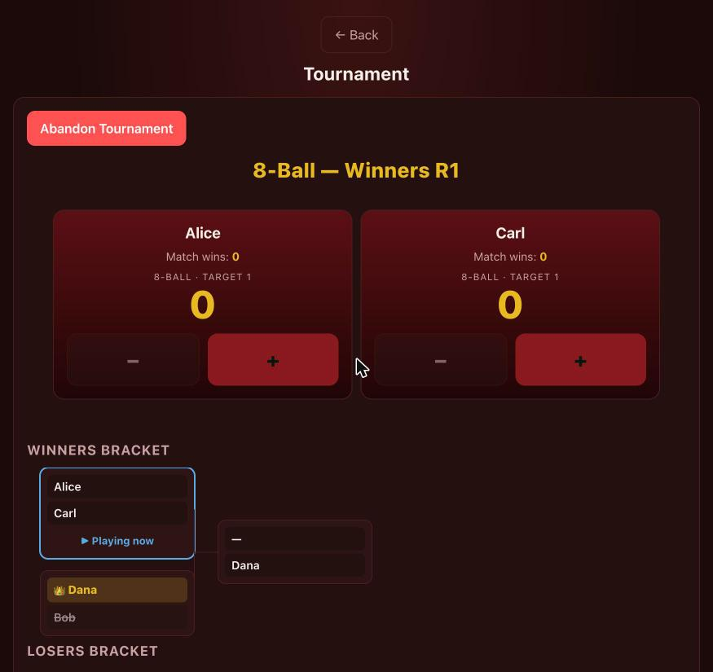

# Pool Master Counter

A touch-friendly pool scoring app for phone, tablet, or desktop. It runs entirely in the browser — no server, no account, no build step — and remembers everything on the device it's used on: your roster, career stats, saved player lists, game-order rotations, and tournament brackets.

## Table of contents

- [Quick start: the Setup Wizard](#quick-start-the-setup-wizard)
- [Manual setup](#manual-setup)
- [Players & saved player lists](#players--saved-player-lists)
- [Live play & scoreboard](#live-play--scoreboard)
- [Game Order (rotations)](#game-order-rotations)
- [Tournaments (double elimination)](#tournaments-double-elimination)
- [All Players & career stats](#all-players--career-stats)
- [Individual player page](#individual-player-page)
- [Focus Mode](#focus-mode)
- [Backup, import/export & data safety](#backup-importexport--data-safety)
- [Names are case-insensitive](#names-are-case-insensitive)
- [Data & privacy](#data--privacy)
- [Running it](#running-it)
- [Project structure](#project-structure)

## Quick start: the Setup Wizard

The fastest way to get a game going is the **🧙 Start Wizard** button at the top of the page. It walks through everything needed to start playing in five short steps, explaining each one in plain language along the way.

1. **Game type & format** — pick the game (8-Ball, 9-Ball, Straight Pool, One Pocket, etc.) and how you want to play:
   - **Individual** — casual play, no fixed target.
   - **Race To** — first to a target number of wins; the wizard asks for the number.
   - **Tournament Elimination** — skips straight to the bracket setup described below instead of a regular session.
2. **Players** — load an existing saved player list, add new players, or both.
3. **Playing vs. Standby** — turn "Playing" on for everyone in this game; anyone left on "Standby" sits out but stays on the roster for later. At least two players must be marked Playing to continue.
4. **Rotation** — a plain-language yes/no: "Do you want to automatically switch between game types?" Choosing yes reveals the same rotation builder described in [Game Order](#game-order-rotations); choosing no skips straight to the summary.
5. **Review & Start** — a summary of every choice made. Hitting **Start Game** applies everything, switches to [Focus Mode](#focus-mode), and closes the wizard. Choosing Tournament Elimination in step 1 changes this into **Go to Tournament Setup**, which hands off to the tournament page instead.

Canceling the wizard at any point is safe — any players you added or rotation changes you made are already saved (the same way they would be if you'd used the panels directly), so nothing is lost or rolled back.

## Manual setup

Prefer to configure things yourself instead of the wizard? The main page has the same controls laid out as panels, top to bottom: **Backup & Transfer** (collapsed by default — tap the chevron to expand), **Game Order**, **Current Game**, and **Players**.

- **Current Game** — pick the game type, the per-rack/point/ball target, Individual vs. Teams mode, and the race-to-wins milestone for the whole session.
- **Game Order** — see [below](#game-order-rotations).
- **Players** — see [below](#players--saved-player-lists).

## Players & saved player lists

- **Add a player** by typing a name and tapping **Add**. Names are automatically capitalized ("bob smith" → "Bob Smith") and checked for duplicates as you type — the Add button stays disabled and a red note explains the conflict if the nickname is already on the roster; add a last name or initial to tell two players apart.
- **Standby / Playing** — tap a player's badge to move them in or out of the current game without removing them from the roster.
- **Remove a player** (✕) takes them off today's active list only — their career stats and game history stay on the device and still show up on the [All Players page](#all-players--career-stats).
- **Saved player lists** — pick a previously saved list from the dropdown and tap **Load Player List** to add anyone from that list who isn't already on the roster (existing players and any in-progress game are never touched or reset).
- **Auto-save** — any time the roster actually changes (a player added, removed, or a saved list loaded) or a new game is credited, the app checks whether that exact set of players is already saved. If it isn't, it's saved as a new entry in the dropdown *and* a fresh backup JSON file is downloaded automatically — so every distinct group you've ever played with is one click away, with no manual saving required.
- **Export / Import Player Lists** — a dedicated, hand-editable JSON format (separate from the full data backup) for writing or tweaking player lists outside the app. Import accepts that format, a full backup's roster list, or even a bare array of names, and never creates duplicates on repeated imports.

## Live play & scoreboard

- Tap **+** / **−** on a player's card to track balls, points, or racks toward the current game's target; each distinct positive/negative tap plays its own synthesized tone (no audio files).
- Reaching the game's target banks a win for that player (or team) and starts the next game automatically.
- **Standings** show live progress toward the race-to-wins milestone, both by team and individually.
- **Milestone, On-the-Hill, and Game Changed pop-ups** celebrate a race-to win, warn when someone is one win from it, and announce when the rotation switches game types.
- **Undo Last Win**, **Reset Current Game**, **Share Standings** (pre-filled email), and **Export Session** (JSON) are all one tap away.
- **New Game** starts a fresh session; if there are unsaved games it offers to save them to career stats first, skip saving, or cancel.
- **Recent Games** lists everything played this session.

## Game Order (rotations)

Turn on **Rotate game types automatically** to have the app cycle through a sequence of game types on its own — for example, three games of 8-Ball, then switch to 9-Ball.

- Build the order with the game-type dropdown and **+ Add to Order**; reorder or remove entries with the ↑ / ↓ / ✕ controls.
- **Switch every N games** controls how often it advances, and the status line always shows the current game type, the next one, and how many games remain until the switch.
- **Saved rotations** work exactly like saved player lists: pick one from the **Load Rotation** dropdown to replace the current order outright (a sequence isn't something to merge), and any genuinely new sequence you build is automatically saved as a new loadable entry the moment it's set up or a game is played with it.

## Tournaments (double elimination)

Tap **🏆 Tournament** (or choose Tournament Elimination in the wizard) to run a knockout bracket instead of a regular session.

- **Setup** — pick the game type, per-match target, race-to for each match, and check off who's competing; seeding is a random draw.
- **Winners bracket, losers bracket, and grand final** render as a horizontal tree with connector lines, so the whole bracket's shape is visible at a glance.
- Each match plays out on the same familiar +/− scoreboard used everywhere else; the currently active match is highlighted and can't be re-triggered accidentally.
- Eliminated players are struck through; the eventual champion gets a 👑.
- Every rack played in a tournament still counts toward each player's career stats and the All Players graphs — it isn't a separate, disconnected pool of data.

## All Players & career stats

Tap **📊 All Players** to see everyone who has ever played on this device — including players no longer on the active roster and anyone who only appears in this session's not-yet-saved history.

- **Sort** by win percentage, total wins, or name, and filter the **time period** shown (Today, 1 Week, 1 Month, 6 Months, 1 Year, All Time).
- **Bar view** shows Games Played / Won / Lost as scaled bars plus a timeline of when each player played.
- **📈 See as Graph** switches to a cumulative line chart per player instead (see below).
- **👥 Current Roster Only** hides everyone not currently on the live roster, without deleting anything — turn it off to see everyone again.

In graph view, players currently on the roster show their chart immediately; everyone else collapses to just their name and a **Show Graph** button, so the page stays scannable while every player stays one tap away. Each graph plots cumulative games played/won/lost over time (with a separate line per teammate combination in Teams mode), with smoothed, non-overshooting curves, a dot at each real data point, and a legend where every line can be shown or hidden individually — Lost lines start hidden by default to reduce clutter. The horizontal axis always runs to "now," with graduations matching the period selected (hours for Today, days for a week/month, dates for a year).

## Individual player page

Tap a player's name (from the roster, All Players, or their 📊 icon) to open their own page:

- **Stats synopsis** — wins, losses, and win % for Today, This Week, This Month, This Year, or All Time.
- **Head-to-head** — win/loss record against every opponent they've faced.
- **Graph** — the same cumulative chart used on the All Players page, scoped to just this player.
- **This Session (Live)** — what they've done in the game currently in progress.
- **Session History** — every past saved session, expandable into the individual games played.
- **Export Stats** saves the current live session into their permanent history; **Reset Stats** clears just this player's saved history (their name stays on the All Players list if they're still on the roster or have unsaved games).

## Focus Mode

Tap **Focus Mode** (or finish the Setup Wizard) to hide every setup/stats panel and show only the live scoreboard — ideal once everyone's ready to play and you just want ball counters on screen. Tap **Show All** to bring the rest of the page back.

## Backup, import/export & data safety

Everything lives in the browser's local storage on that one device — there's no cloud sync — so the Backup & Transfer panel (top of the page, tap the chevron to expand) is how you move data around or protect it:

- **Export All Data** downloads one JSON file containing the full picture: the live session, every saved player list, every saved rotation, and every player's career stats.
- **Import Data** reads that file back in. If the device is brand new (no players yet) it adopts the backup as-is; otherwise it *merges*: career stats and saved lists are combined without double-counting games already known on both sides, new players (including anyone who only appears inside an imported saved list) are added to the roster, and the game currently in progress is left untouched.
- **Reset All Player Stats** clears everyone's saved career history (not the live session). It always downloads a full backup first and asks for confirmation, since this can't be undone otherwise.
- **Reset Player Lists** clears every saved player list from the "Load Player List" dropdown, the same way: backs up first, asks for confirmation, and the backup can be restored later with **Import Player Lists**.

## Names are case-insensitive

"Bob" and "bob" are always treated as the same person. Typing a name that matches someone already known (on the roster, in career stats, or in unsaved game history) reuses their existing capitalization instead of creating a second, fragmented player; a brand-new name gets its first letter (and the first letter of each word) capitalized automatically. If two entries already existed under different casing before this behavior shipped, the app quietly merges their history back together the next time it loads.

## Data & privacy

All data — players, stats, rotations, tournaments, everything — stays in the browser's local storage on the device you're using. Nothing is sent to a server. Clearing your browser's site data for this page, or switching devices/browsers, starts fresh unless you've exported and imported a backup first.

## Running it

This is a static site — no build step or dependencies.

- **Locally:** open `index.html` in a browser, or serve the folder (e.g. `python3 -m http.server`) and visit it.
- **Online:** enable GitHub Pages for this repo (Settings → Pages → deploy from the `main` branch) and it's live at `https://<username>.github.io/Pool-master-counter/`.

## Project structure

- `index.html` — markup for every view: the main scoreboard, the Setup Wizard, the Tournament page, the All Players page, and the individual player page
- `css/style.css` — responsive, touch-friendly styling, theme colors, and layout for every panel and overlay
- `js/app.js` — all app state, localStorage persistence, sound synthesis, and UI logic (single IIFE, no framework)
- `docs/screenshots/` — the screenshots used in this README
- `players/`, `settings/`, `stats/` — legacy data files from an earlier version of the app that stored data as JSON committed to the repo; kept only so a device's first launch can migrate that history into local storage. The app never writes to these directories anymore.
