# Pool Master Counter

[🇬🇧 English](README.md) · [🇫🇷 Français](README.fr.md) · [🇪🇸 Español](README.es.md) · **🇭🇰 廣東話**

一個方便觸控操作嘅桌球計分應用程式，可以喺手機、平板或者電腦上使用。佢完全喺瀏覽器入面運作——冇伺服器、冇帳戶、冇 build 步驟——並且會將所有嘢記住喺你用緊嘅裝置上：你嘅玩家名單、生涯統計、玩家評分、已儲存嘅玩家名單、對局順序輪換、錦標賽對戰表，同每日筆記。

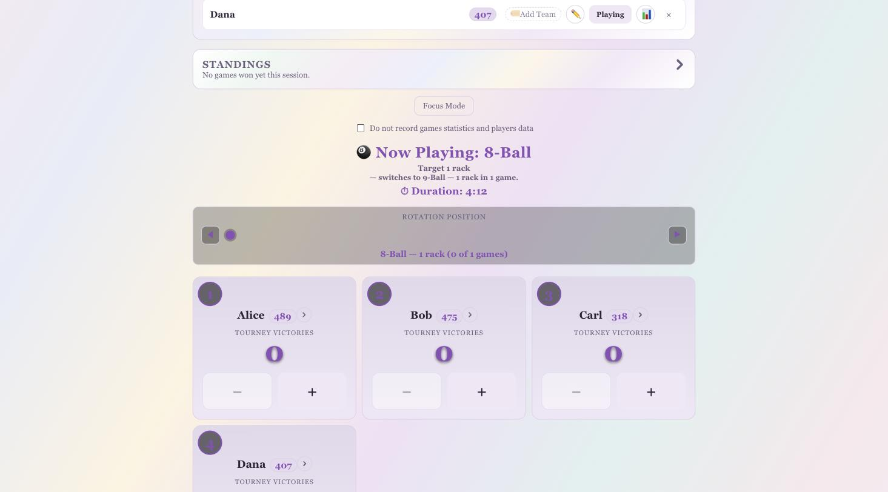

## 目錄

- [快速開始：設定精靈](#快速開始設定精靈)
- [手動設定](#手動設定)
- [主題](#主題)
- [玩家同已儲存嘅玩家名單](#玩家同已儲存嘅玩家名單)
- [即時對局同計分板](#即時對局同計分板)
- [對局順序（輪換）](#對局順序輪換)
- [錦標賽（單敗、雙敗同循環賽）](#錦標賽單敗雙敗同循環賽)
- [所有玩家同生涯統計](#所有玩家同生涯統計)
- [玩家個人頁面](#玩家個人頁面)
- [玩家評分](#玩家評分)
- [聲音](#聲音)
- [今日筆記同每日報告](#今日筆記同每日報告)
- [幫助與指南](#幫助與指南)
- [專注模式](#專注模式)
- [備份、匯入匯出同資料安全](#備份匯入匯出同資料安全)
- [名稱唔分大小楷](#名稱唔分大小楷)
- [資料同私隱](#資料同私隱)
- [點樣執行](#點樣執行)
- [測試](#測試)
- [專案結構](#專案結構)

## 快速開始：設定精靈

開始一局最快嘅方法就係頁面頂部嘅 **🧙 開始精靈** 按鈕。佢會用五個簡短嘅步驟帶你行晒開始打波所需嘅一切，逐步用簡單易明嘅語言解釋。

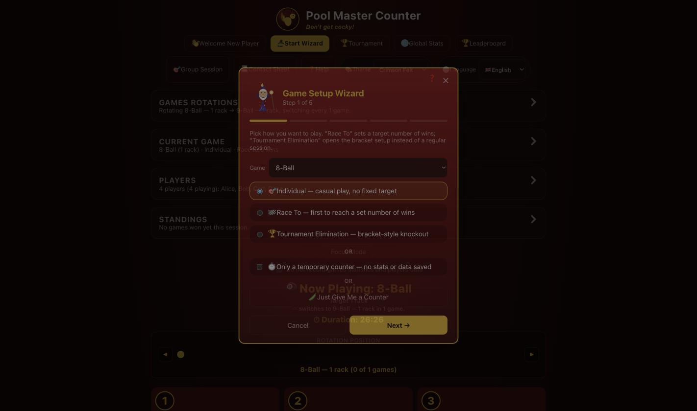

1. **對局類型同格式**——揀選遊戲（8-Ball、9-Ball、直落、單袋等）同埋你想點樣玩：
   - **個人賽**——隨意玩，冇固定目標。
   - **連勝賽**——最先達到指定勝場數就贏；精靈會問你要幾多場。呢個都算係一種錦標賽——見[錦標賽](#錦標賽單敗雙敗同循環賽)。
   - **淘汰錦標賽**——直接跳去下面描述嘅對戰表設定，而唔係一般場次。
2. **玩家**——載入一個已儲存嘅玩家名單、新增玩家，或者兩樣都做。
3. **上場 vs 候場**——將今局所有參加者都設做「上場」；留喺「候場」嘅人今次唔玩，但仍然留喺名單度以便遲啲用。最少要有兩位玩家設做上場先可以繼續。
4. **輪換**——一個簡單嘅係／唔使問題：「係咪要自動喺唔同對局類型之間切換？」揀「要」就會顯示同[對局順序](#對局順序輪換)入面一樣嘅輪換建立工具；揀「唔使」就直接跳去摘要。
5. **檢查同開始**——每一項選擇嘅摘要。撳**開始對局**就會全部套用、切換去[專注模式](#專注模式)，並且關閉精靈。喺第一步揀咗淘汰錦標賽嘅話，呢個按鈕就會變成**前往錦標賽設定**，改為帶你去錦標賽頁面。

隨時取消精靈都好安全——過程入面新增咗嘅玩家或者輪換設定嘅改動已經儲存咗（就好似你直接用返主頁面板一樣），所以唔會有任何嘢失去或者被還原。

## 手動設定

想自己手動設定，唔用精靈？主頁提供咗同樣嘅控制項，以面板形式由上到下排列：**備份與轉移**（預設摺埋——撳箭嘴展開）、**對局順序**、**目前對局**，同**玩家**。

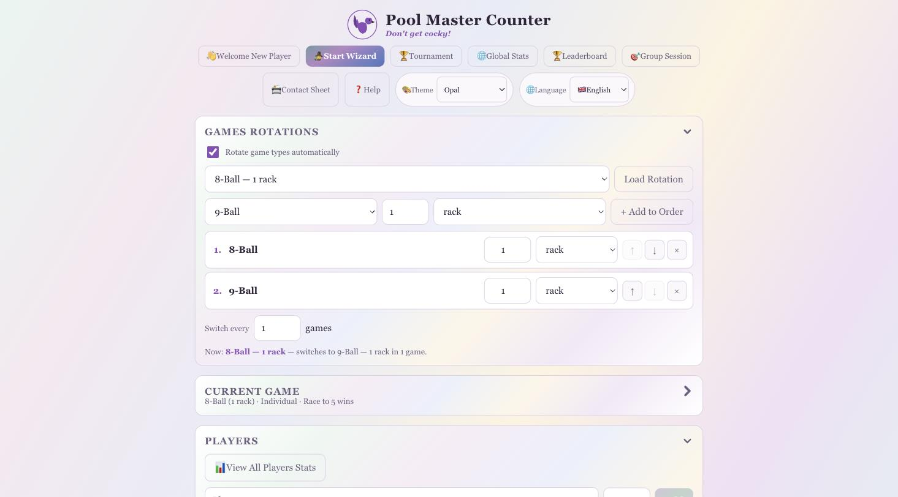

- **目前對局**——揀對局類型、目標數字，同單位（局/波/分——可以獨立於對局類型嘅慣常預設值調整，例如「單袋」可以將目標設做「1局」而唔係慣常嘅「8波」）、個人賽定隊制模式，同埋成個場次嘅目標勝場。
- **對局順序**——見[下面](#對局順序輪換)。
- **玩家**——見[下面](#玩家同已儲存嘅玩家名單)。

## 主題

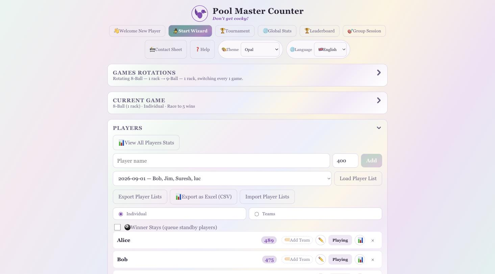

一個 **🎨 主題** 下拉選單，固定喺每一頁畫面嘅右上角，一撳就可以切換成個應用程式嘅顏色同字體，並且會喺重新載入之間記住你嘅選擇（喺頁面繪製之前就同步套用，所以唔會閃過錯誤嘅主題）。十款配色，喺下拉選單入面分組：

- **深色**——緋紅台呢（原本嘅外觀，亦係預設）、翡翠檯邊、霓虹街機（等寬字體）、午夜象牙（襯線字體）、夕陽粉筆、黑曜開球。
- **淺色**——破曉粉筆同珍珠會客廳，係真正嘅淺色模式配色，而唔係單純將深色主題調淺。
- **高對比**——極致對比（黑／黃／白）同紙白對比（白／黑／藍），用嚟達到最高嘅可讀性。

每一種需要喺強調色背景上清晰可讀嘅顏色（按鈕、開關、徽章）都係按主題計算出嚟，確保符合 WCAG 可讀性標準，而唔係憑空假設——所以一個按鈕絕對唔會因為某個主題嘅強調色啱啱好偏暗，就變成文字幾乎睇唔清。圖表本身嘅背景（見[所有玩家](#所有玩家同生涯統計)）都用同樣嘅按主題處理方式：一層淡淡嘅、帶有該主題強調色色調嘅底色，絕對唔會係一個死板嘅中性灰色。

## 玩家同已儲存嘅玩家名單

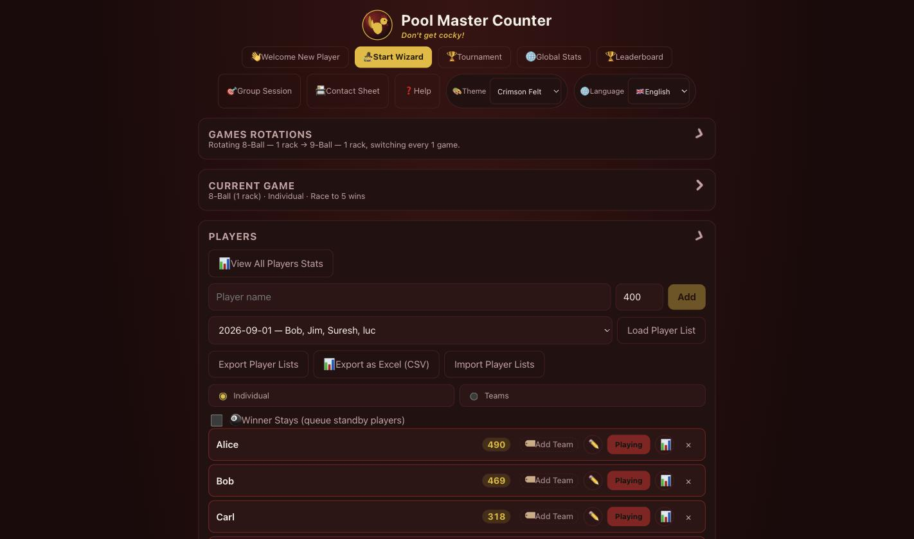

- **新增玩家**：打入個名，撳**新增**就得。名稱會自動變大楷（「阿明」就唔變，但英文名例如「bob」→「Bob」），並且會即時檢查有冇重複——如果暱稱已經喺名單上，「新增」按鈕會保持冇反應，仲有紅色提示解釋衝突；加個姓氏或者字首就可以分辨兩位玩家。
- **候場 / 上場**——撳玩家嘅徽章就可以將佢調入或者調出而家嘅對局，唔會將佢由名單度移除。
- **移除玩家**（✕）淨係將佢由今日嘅活躍名單移除——佢嘅生涯統計同對局紀錄仍然會留喺裝置度，仲會喺[「所有玩家」頁面](#所有玩家同生涯統計)出現。
- **已儲存嘅玩家名單**——喺下拉選單揀返一個之前儲存過嘅名單，撳**載入玩家名單**就可以將個名單入面所有仲未喺現有名單度嘅人加入嚟（現有玩家同任何進行緊嘅對局都絕對唔會被更改或者重設）。
- **自動儲存**——每次名單真正有變動（新增咗、移除咗玩家，或者載入咗一個已儲存名單），或者一局新對局被記錄，應用程式就會檢查呢一組完全一樣嘅玩家係咪已經儲存咗。如果冇，就會喺下拉選單度儲存做新一項，*並且*自動下載一個新嘅備份 JSON 檔案——所以你曾經一齊打過波嘅每一個獨特組合，都係一撳就有，唔使手動儲存。
- **匯出／匯入玩家名單**——一種專門、可以手動編輯嘅 JSON 格式（同完整資料備份分開），方便喺應用程式以外編寫或者修改玩家名單。匯入功能接受呢種格式、完整備份入面嘅名單，甚至一個純粹嘅名稱陣列，並且重複匯入絕對唔會產生重複資料。
- **跳去玩家嘅統計頁面**——喺任何顯示玩家個名嘅地方（計分板、排名、錦標賽對局卡片、所有玩家），旁邊嘅細細一個圖示按鈕一撳就會打開嗰位玩家自己嘅[統計頁面](#玩家個人頁面)。

## 即時對局同計分板

- 撳玩家卡片上嘅 **+** / **−** 就可以追蹤朝住目前對局目標進發嘅波、分，或者局數；每一次正／負嘅獨立撳擊都會播放自己嘅合成音效（冇音訊檔案——見[聲音](#聲音)）。
- 達到對局嘅目標就會為嗰位玩家（或者隊伍）計入一勝，並且自動開始下一局。
- **錦標賽勝場**——每張卡片自己朝住呢個場次連勝目標邁進嘅進度（一個大大粗體嘅數字，喺枱嘅另一邊都可以一眼睇到）。達成佢就係一次錦標賽勝利——見[錦標賽](#錦標賽單敗雙敗同循環賽)。
- **排名**會顯示隊伍同個人朝住連勝目標嘅即時進度。
- **達標、埋門，同對局已變更彈出提示**分別會慶祝一次連勝勝利、喺有人差一場就達標時發出警告，同埋喺輪換切換對局類型時作出宣佈。贏晒成個連勝到 N 場嘅目標，會播放同錦標賽對戰表冠軍一樣嘅《歡樂頌》號角聲——見[聲音](#聲音)。
- **「唔記錄對局統計同玩家資料」**——打勾就可以玩一個純粹喺記憶體入面進行嘅場次：喺你取消打勾之前，乜嘢都唔會被儲存（冇狀態、冇生涯統計、冇評分）；勝場仍然會即時喺呢個瀏覽器分頁度顯示計數，但重新載入之後就冇晒——適合一場唔應該計數嘅隨便練習場。
- **撤銷上一勝**、**重設目前對局**、**分享排名**（預先填好嘅電郵）、同**匯出場次**（JSON）全部都係一撳就有。
- **新對局**會開始一個全新場次；如果有未儲存嘅對局，會提議你先儲存去生涯統計、跳過儲存，或者取消。
- **近期對局**會列出呢個場次打過嘅所有嘢。

## 對局順序（輪換）

打開**自動輪換對局類型**，應用程式就會自行輪流進行一連串對局*規則*——例如，先1局8-Ball，跟住3局8-Ball，再到9-Ball。

- 順序入面嘅每一步都係獨立嘅規則——對局類型、目標數字同單位——唔單止係一個對局類型，所以同一個對局類型可以用唔同規則出現兩次（「8-Ball——1局」同「8-Ball——3局」係兩個獨立嘅步驟）。用對局類型下拉選單加目標同單位欄位嚟建立順序，再撳 **+ 加入順序**；用 ↑ / ↓ / ✕ 控制項重新排序或者移除項目，又或者直接喺列表入面編輯某一步嘅目標／單位。列表永遠會顯示每一步嘅完整規則，唔單止佢嘅對局類型。
- **每隔 N 局**控制幾耐先切換一次，狀態列永遠會顯示現時嘅規則、下一個規則，同仲有幾多局先切換。
- **已儲存嘅輪換**運作方式同已儲存嘅玩家名單一樣：喺**載入輪換**下拉選單度揀一個，就會將現有順序整個取代（一個順序唔係用嚟合併嘅嘢），而你新建嘅任何真正嶄新順序，一喺設定好或者一開始被用嚟打波，就會自動儲存做一個可載入嘅新項目。

## 錦標賽（單敗、雙敗同循環賽）

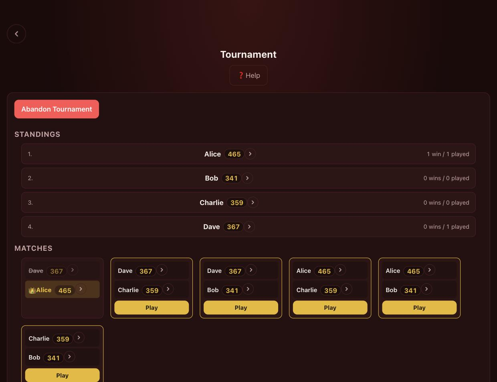

撳 **🏆 錦標賽**（或者喺精靈入面揀淘汰錦標賽）就可以進行一個淘汰賽對戰表——或者循環賽——嚟代替一般場次。

**賽制**——三個選擇，每個都會喺你揀之前直接解釋清楚：

- **雙敗淘汰**——輸一次就跌落敗部，仲有多一次機會；輸兩次就出局。呢個係預設賽制：比較公平，但耗時較長。
- **單敗淘汰**——輸一次就出局。更快，冇敗部亦冇總決賽。
- **循環賽**——完全冇淘汰。每位玩家同其他每一位都會啱啱好打一場（對局順序係隨機打亂——冇乜種子排位可言），一旦所有對局都有結果，贏最多場嘅就係冠軍；如果並列首位，所有並列嘅玩家就一齊共享冠軍。最啱一個隨意組合、想每個人打波局數平均嘅小組。

除咗賽制唔同之外，設定方式其他一樣：揀對局類型、每場目標、每場連勝目標，同勾選邊個參賽。

- **淘汰式賽制**會以水平樹狀圖加連接線嘅形式，顯示勝部對戰表（喺雙敗淘汰仲有敗部同總決賽），令成個對戰表嘅形狀一眼睇晒。已被淘汰嘅玩家會加劃線。
- **循環賽**就會改為顯示一個即時**排名**列表——按勝場數排序，每場過後即時更新——喺一個顯示晒所有對陣嘅**對局**格仔上面（唔單止而家可以打嘅對局），等你隨時都可以睇到完成咗幾多同重剩幾多。
- 每場對局都用返成個應用程式其他地方一樣熟悉嘅 +/− 計分板嚟進行；而家進行緊嘅對局會被高亮，並且唔會意外被再次觸發。
- 最終冠軍（或者循環賽平手時嘅並列冠軍）會有一個 👑，收到結果大約一秒之後就會播放完場號角——見[聲音](#聲音)。
- 喺錦標賽入面打嘅每一局，仍然計入每位玩家嘅生涯統計、評分，同「所有玩家」嘅圖表——並唔係另外分開、獨立嘅一堆資料。

### 連勝到 N 場嘅場次都算錦標賽

一般場次嘅連勝目標（計分板上嘅**錦標賽勝場**計數器）喺每一項有追蹤佢嘅統計入面都算做一個錦標賽，同對戰表錦標賽一樣——達成佢就會為贏家（或者贏嘅隊伍）記一次錦標賽勝場，並為當時其他所有出場過嘅人記一次錦標賽負場，同對戰表冠軍同佢擊敗過嘅對手完全一樣。呢個係由現有對局紀錄自動推算出嚟，所以都會追溯適用——呢部裝置上任何曾經完成過嘅連勝到 N 場次，一有呢個功能就會即刻顯示出嚟，唔單止之後新開嘅場次。

## 所有玩家同生涯統計

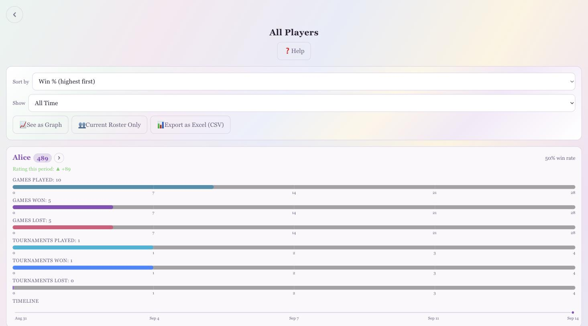

撳 **📊 所有玩家**就可以睇到呢部裝置上曾經打過波嘅每一個人——包括而家唔喺活躍名單上嘅玩家，同淨係出現喺呢個場次未儲存紀錄入面嘅人。

- **排序**依勝率、總勝場，或者名稱，並且可以篩選顯示嘅**時間範圍**（今日、1星期、1個月、6個月、1年、全部時間）。
- **長條圖檢視**以比例長條顯示已玩／勝／負局數，其下面就係參與／勝／負錦標賽（只有真正參加過錦標賽嘅玩家先會顯示），仲有一條時間軸顯示每位玩家幾時有出場。
- **📈 以圖表顯示**會改為切換做每位玩家嘅累積折線圖（見下面）。
- **👥 只顯示現有名單**會隱藏所有唔喺即時名單上嘅人，但唔會刪除任何資料——再撳一次就可以睇返晒所有人。

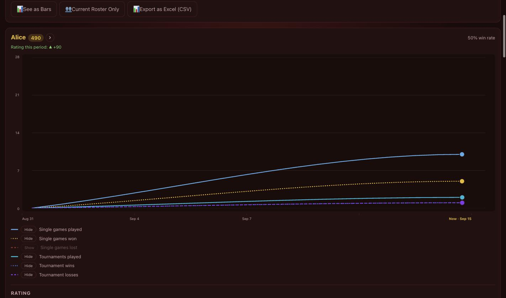

喺圖表檢視入面，仍然喺名單上嘅玩家會即刻顯示佢哋嘅圖表；其他人就會摺埋做一個名同一個**顯示圖表**按鈕，等成個頁面保持易於瀏覽，而每位玩家都仍然只係一撳之遙。每個圖表都會畫出隨時間累積嘅數字：**個人賽**已玩／勝／負局數（隊制模式下每個隊友組合各有獨立一條線），同**錦標賽**已玩／勝／負並列顯示——用一套固定嘅藍／青／紫配色，唔理而家用緊邊個主題，都會同個人賽嘅線清楚分開（同埋互相之間都分得清）。曲線經過平滑處理並且唔會過衝，每個實際數據點都有一粒圓點，仲有一個圖例可以逐條線分別顯示或者隱藏——「負」嘅線預設隱藏，減少畫面雜亂。

**撳任何一粒圓點**就會喺旁邊彈出一個細細嘅視窗：如果係個人賽或者錦標賽嘅點，就會顯示嗰個點背後嘅每一位對手，同對每一位嘅勝負紀錄（「對 Bob——3勝1負」）；如果係**評分**嘅點（下面嗰個獨立圖表，追蹤呢位玩家喺同一段時間嘅評分），就會顯示嗰一點嘅確實評分、呢位玩家喺嗰一局嘅評分變動，同每位對手喺同一局嘅評分變動，等你清楚知道邊個贏咗評分、邊個輸咗。撳其他任何地方就可以關閉。

水平軸永遠去到「而家」，刻度會配合所揀嘅時間範圍（今日用小時、一星期或一個月用日，一年用日期）。每位玩家個名都會以一個細細嘅徽章顯示佢現時嘅[評分](#玩家評分)，每張卡片都會顯示嗰個評分喺所選時段入面變動咗幾多（例如「▲ +18」）。

## 玩家個人頁面

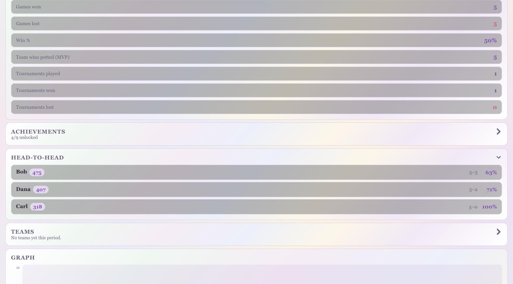

喺應用程式入面任何地方撳玩家個名（或者佢細細嘅圖示按鈕）就可以打開佢自己嘅頁面。頁首直接有一個下拉選單，等你可以直接跳去任何一位已知玩家，唔使返去「所有玩家」。

- **統計摘要**——現時評分同呢段時間嘅變動、個人賽勝／負／勝率，同參與／勝／負錦標賽，涵蓋今日、本星期、本月、今年，或者全部時間。
- **對戰紀錄**——對每一位對手嘅勝負紀錄。
- **圖表**——同「所有玩家」頁面一樣嘅累積圖表（同撳一下就顯示嘅資訊窗），但只限呢一位玩家，另加佢自己嘅評分圖表。
- **今場（即時）**——佢喺而家進行緊嘅對局入面做過啲乜。
- **場次紀錄**——每一個已儲存嘅過往場次，可以展開睇返逐局嘅對局。
- **匯出統計**會將而家即時嘅場次儲存做永久紀錄；**重設統計**就淨係清除呢位玩家已儲存嘅紀錄（如果佢仍然喺名單上或者有未儲存嘅對局，個名仍然會留喺「所有玩家」列表；佢嘅評分唔會受影響——評分自己有獨立儲存）。

## 玩家評分

每位玩家都有一個自動、Elo 風格嘅評分，靈感來自 [FargoRate](https://fargorate.com/) 公佈嘅評分刻度——即係美國撞球聯賽（USA Pool League）同大部分美國職業聯賽背後嘅系統。呢個係一個大約 0–900 嘅刻度，兩個評分之間相差100分，大約等於2:1嘅預期勝率，每100分就翻一倍（所以相差200分大約係4:1，300分大約係8:1）。新玩家一開始就係 **400** 分。

- 評分會以一個細細嘅徽章形式，喺任何顯示玩家個名嘅地方出現——名單、計分板、錦標賽對局卡片、所有玩家，同玩家統計頁面。
- 佢會喺每一局計入紀錄之後自動更新（主計分板或者錦標賽對局都計），包括隊制對局（每一方嘅平均評分會用嚟計算預期勝率，而得出嚟嘅變動會平均套用喺嗰一方每位成員身上）。新玩家或者評分未穩定嘅玩家喺頭20局會變動得快啲，之後就會慢返落嚟。
- 撳評分圖表（所有玩家或者玩家統計頁面）上嘅一粒圓點，就可以確切睇到嗰一點發生咗乜——見[所有玩家](#所有玩家同生涯統計)。
- **完全冇辦法手動修改評分。** 佢淨係會因為已記錄嘅對局而變動。
- 評分有自己獨立、以名稱做索引嘅儲存空間，同生涯統計分開，所以就算玩家由名單度移除，評分都會保留，並且唔會受「重設所有玩家統計」影響。佢哋都會包含喺完整資料備份／匯入入面。

呢個係一套由零開始、對齊 FargoRate *公佈*賠率同刻度計算出嚟嘅系統——並唔係逆向工程抄襲 Fargo 自己嘅演算法（嗰個會將每位玩家嘅評分一齊放入一個專有嘅每日全域最佳化計算入面，唔係一個靜態應用程式可以喺客戶端執行嘅嘢）。

## 聲音

每個聲音都係用 Web Audio API 即時合成——冇音訊檔案，冇嘢要下載。贏或者輸都會播放一段短音；達成一個連勝到 N 場嘅目標（一般場次或者對戰表錦標賽）就會播放一段更盛大嘅號角聲：貝多芬第九交響曲（《歡樂頌》）完整30個音符嘅主旋律，用低音演奏，並且加咗合成殘響尾音，帶出一種深沉、勝利嘅感覺，喺勝利公佈大約一秒之後先開始播放，避免同宣佈本身撞埋一齊。

## 今日筆記同每日報告

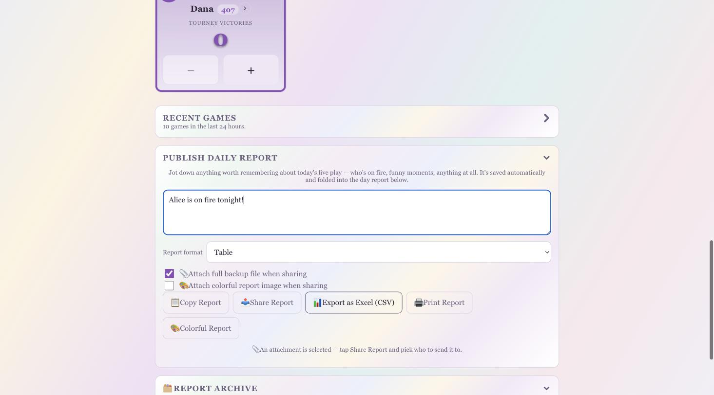

主頁上面有一個自由輸入嘅文字框，用嚟記低任何關於今日即時對局嘅內容——邊個狀態勁、有咩趣事，乜都得，只要值得記住。你打字嘅時候會自動儲存，並且以日曆日期做索引。

**複製報告**、**用電郵傳送報告**，同**用短訊傳送報告**都會整出同一份純文字每日摘要——今日有出場嘅每位玩家、佢哋嘅勝負紀錄同評分變動、總共打咗幾多局同乜嘢對局類型，同你嘅筆記——然後將佢複製去剪貼簿、喺一個預先填好嘅電郵度打開，或者喺一個預先填好嘅短訊度打開，隨時可以直接傳送。呢份報告係由今日日期嘅即時同已儲存場次合併而成，所以就算今日早啲時候用過「新對局」，內容依然準確。

## 幫助與指南

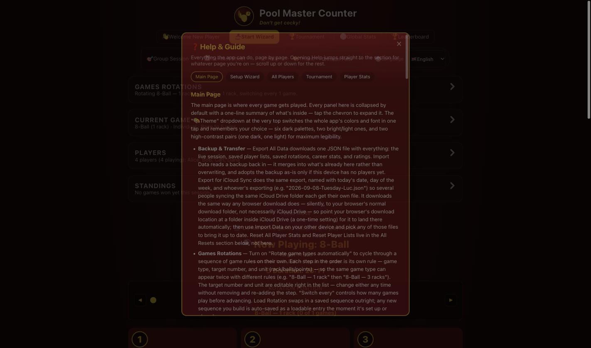

撳 **❓ 幫助**——每一頁都有（主頁、設定精靈、所有玩家、錦標賽，同玩家統計頁面）——就可以打開一份涵蓋每一頁每個功能嘅單一指南。佢係因應情境嘅：打開之後會直接跳去你而家所在頁面嘅章節，並附有一個快速導覽方便瀏覽其他部分。標題、簡介，同導覽會喺你捲動一個章節嘅時候一直固定喺頂部。

## 專注模式

撳**專注模式**（或者完成設定精靈）就可以隱藏晒所有設定／統計面板，只顯示即時計分板——最啱大家準備好開波、你淨係想螢幕上有波數計數器嘅時候用。撳**全部顯示**就可以攞返頁面其餘部分。

## 備份、匯入匯出同資料安全

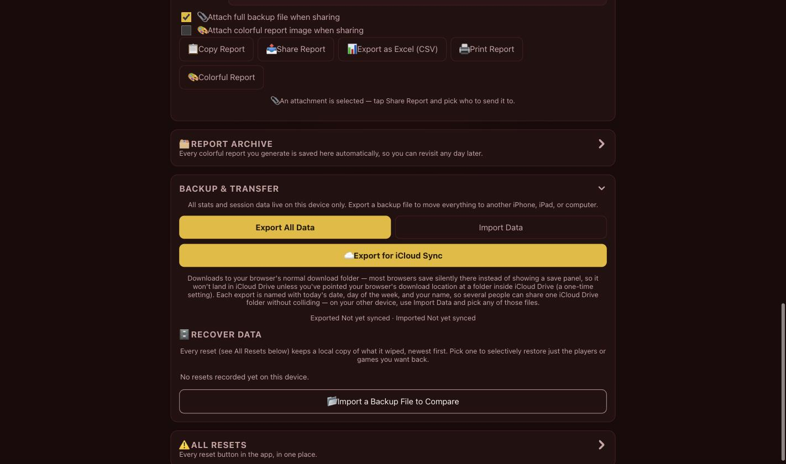

所有嘢都存放喺你用緊嗰部裝置嘅瀏覽器本機儲存空間度——冇雲端同步——所以「備份與轉移」面板（喺頁面頂部，撳箭嘴展開）就係你用嚟搬動或者保護資料嘅方法：

- **匯出所有資料**會下載一個包含晒完整資料嘅單一 JSON 檔案：即時場次、每一個已儲存嘅玩家名單、每一個已儲存嘅輪換、每位玩家嘅生涯統計，同每位玩家嘅評分（現時數字加完整歷史）。
- **匯入資料**會將個檔案讀返返嚟。如果部裝置係全新（仲未有任何玩家），佢就會原封不動採用個備份；否則就會*合併*：生涯統計、已儲存名單，同評分會被合併，唔會將兩邊已經知道嘅對局計多次（評分嘅歷史會做聯集，並且由合併同按時間排序後嘅歷史重新計算現時數值），新玩家（包括淨係出現喺已匯入名單入面嘅人）會加入名單，而目前進行緊嘅對局就唔會被觸碰。
- **重設所有玩家統計**會清除所有人已儲存嘅生涯歷史（唔包括即時場次）。呢個動作永遠會先下載一個完整備份，並且要求確認，因為否則呢個動作就無法還原。
- **重設玩家名單**會用同樣方式，清除「載入玩家名單」下拉選單入面每一個已儲存嘅玩家名單：先備份，要求確認，然後之後可以用**匯入玩家名單**還原備份。

## 名稱唔分大小楷

「Bob」同「bob」永遠都會視為同一個人。打一個同已知玩家（喺名單度、生涯統計入面，或者未儲存嘅對局紀錄入面）相符嘅名，會沿用佢現有嘅大小楷格式，而唔係整多一個分裂咗嘅玩家；一個全新嘅名就會自動將首字母（同每個字嘅首字母）變大楷。如果喺呢個機制推出之前，已經有兩個唔同大小楷嘅項目存在，應用程式下次載入嗰陣就會靜靜哋將佢哋嘅歷史合併返一齊。

## 資料同私隱

所有資料——玩家、統計、輪換、錦標賽，一切嘢——都會留喺你用緊裝置嘅瀏覽器本機儲存空間入面。乜嘢都唔會傳去伺服器。清除呢頁嘅瀏覽器網站資料，或者換一部裝置／瀏覽器，就會由零開始，除非你事先匯出並且匯入過備份。

## 點樣執行

呢個係一個靜態網站——冇 build 步驟，亦冇任何依賴套件。

- **本機：**用瀏覽器打開 `index.html`，或者用某種方式伺服呢個資料夾（例如 `python3 -m http.server`）再瀏覽佢。
- **線上：**為呢個 repo 啟用 GitHub Pages（Settings → Pages → 由 `main` 分支部署），就可以喺 `https://<username>.github.io/Pool-master-counter/` 睇到。

除咗 `main` 之外，仲有另外三個分支：

- **`stable`**——`main` 喺已知穩定時間點嘅快照，只有喺明確要求嘅時候先會 fast-forward。同 `main` 一樣係未壓縮嘅原始碼。
- **`release`**——最新 `main` 嘅壓縮版本（用 `rjsmin`/`rcssmin`），每次都會由零重新建構，而唔係逐次比對，因為佢純粹係衍生出嚟嘅結果。
- **`tests`**——下面描述嘅瀏覽器測試套件所在分支。佢絕對唔會影響 `main` 上應用程式本身冇任何依賴嘅特性。

## 測試

一套完整嘅 Selenium/pytest 瀏覽器測試套件放喺 [`tests`](../../tree/tests) 分支——佢會喺無介面（headless）Chrome 度操作真正嘅應用程式，配合自己嘅靜態檔案伺服器（冇 build 步驟，同應用程式實際發佈嘅方式一致），每個測試都用乾淨嘅 `localStorage`。呢個套件刻意冇放喺 `main`，等發佈出嚟嘅應用程式繼續保持上面所講嘅零依賴特性；只有測試套件本身先需要 Python 套件。

覆蓋範圍包括冷啟動、計分板嘅計分／勝利判斷／撤銷／達標浮層、全部10款主題（包括圖表背景顏色嘅修正）、「所有玩家」嘅長條圖／圖表檢視（包括針對圖表溢出修正嘅回歸測試）、玩家統計嘅摘要／切換器／圓點提示、一場完整打到底嘅對戰表錦標賽，以及「不記錄統計」模式嘅持久性保證。呢個分支上嘅 `tests/README.md` 有安裝同執行嘅說明。

## 專案結構

- `index.html`——每個畫面嘅標記：主計分板、設定精靈、錦標賽頁面、所有玩家頁面，同玩家個人頁面
- `css/style.css`——回應式、觸控友善嘅樣式、主題顏色，同每個面板同浮層嘅版面配置
- `js/app.js`——所有應用程式狀態、localStorage 持久化、聲音合成，同介面邏輯（單一 IIFE，冇用任何框架）
- `docs/screenshots/`——呢份 README 用到嘅截圖
- `players/`、`settings/`、`stats/`——舊版應用程式遺留嘅資料檔案，嗰陣係將資料以 JSON 形式提交去 repo 儲存嘅；而家保留只係為咗方便裝置第一次啟動嗰陣，可以將嗰段歷史遷移去本機儲存。應用程式而家已經完全唔會再寫入呢啲資料夾。
